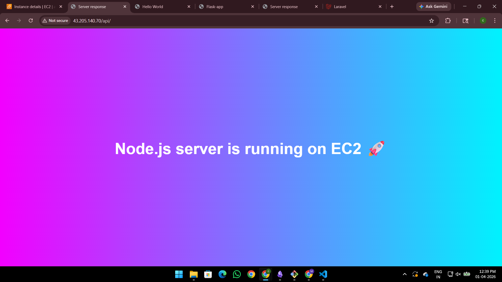
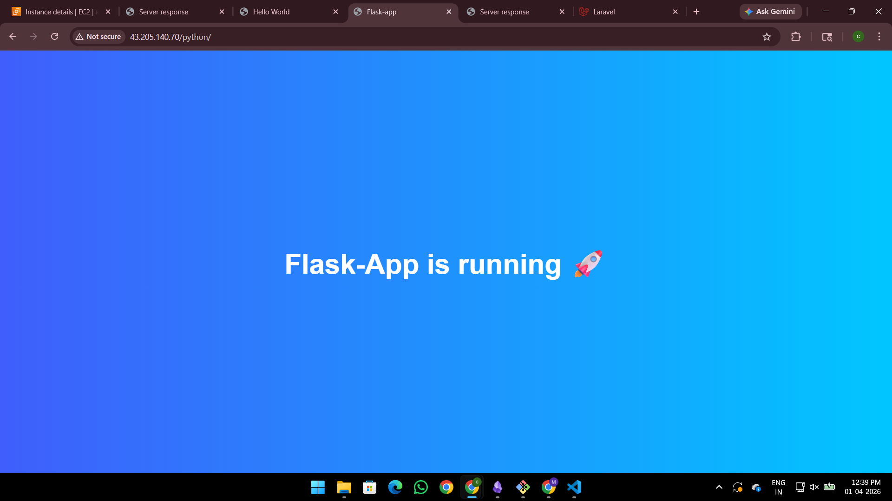
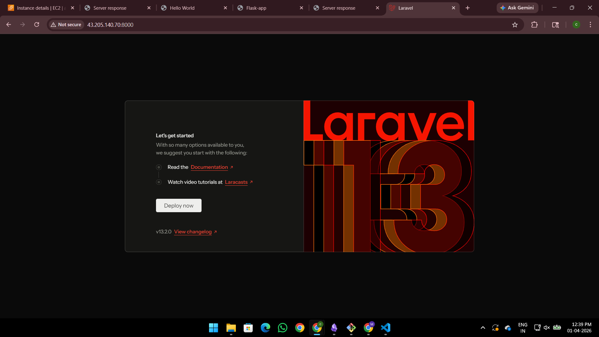
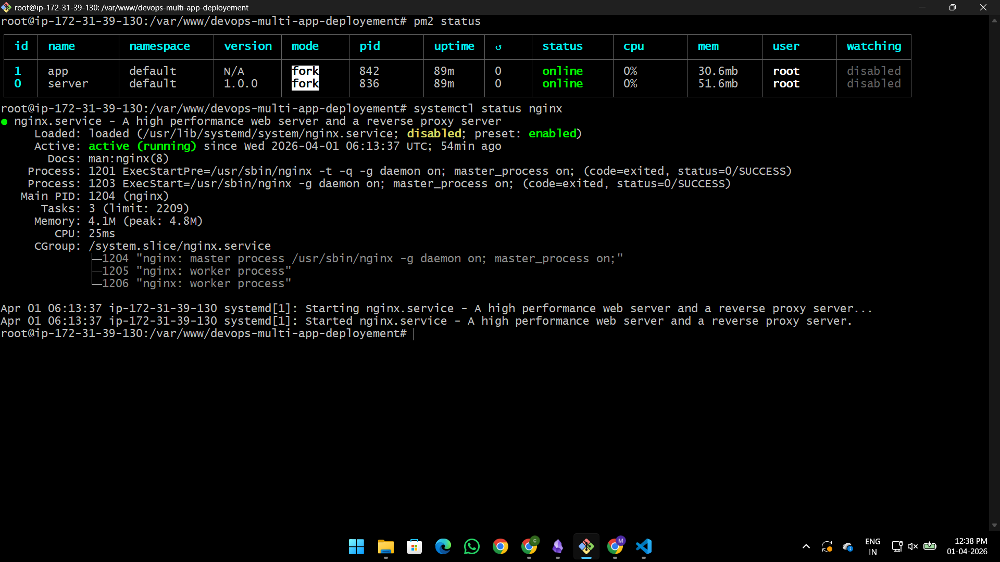

# 🚀 Multi-App Deployment on AWS EC2 using NGINX (DevOps Project)

---

## 📌 Project Overview

This project demonstrates how to deploy and manage multiple backend applications on a single AWS EC2 instance using **NGINX as a reverse proxy**.

It simulates a real-world production-like environment where multiple services run together and are accessed through a unified entry point.

---

## 🧠 Key Highlights

* Multi-service deployment on a single server
* Reverse proxy configuration using NGINX
* Automated setup using `setup.sh`
* Automated updates using `deploy.sh`
* Real-world debugging experience (permissions, routing, services)
* Process management using PM2

---

## 🏗️ Architecture

```text
Client (Browser)
       ↓
   NGINX (Port 80)
       ↓
 ┌───────────────┬───────────────┬───────────────┐
 │               │               │               │
Static Site   Node.js API     Flask App     Laravel App
 (HTML)        (Port 3000)    (Port 5000)    (PHP-FPM)
```

---

## 🌐 Routing

| URL Path   | Service           |
| ---------- | ----------------- |
| `/`        | Static Website    |
| `/api`     | Node.js (Express) |
| `/python`  | Flask             |
| `/laravel` | Laravel           |

---

## 🛠️ Tech Stack

* NGINX (Reverse Proxy)
* Node.js (Express)
* Flask (Python)
* Laravel (PHP)
* PHP-FPM
* PM2 (Process Manager)
* AWS EC2 (Ubuntu)

---

## ⚙️ One-Click Setup (Fresh Server)

### Step 1: Clone repository

```bash
git clone https://github.com/prabool3822/devops-multi-app-deployment.git
cd devops-multi-app-deployment/scripts
```

---

### Step 2: Run setup script

```bash
chmod +x setup.sh
./setup.sh
```

---

## 🚀 What `setup.sh` Does

* Installs all required dependencies
* Sets up Node.js, Flask, and Laravel apps
* Installs Composer and PHP packages
* Configures NGINX
* Fixes permissions
* Starts services using PM2

---

## 🔄 Deployment (After Code Changes)

Whenever you update code:

```bash
cd /var/www/devops-multi-app-deployment/scripts
./deploy.sh
```

---

## 🚀 What `deploy.sh` Does

* Pulls latest code from GitHub
* Updates dependencies
* Restarts Node and Flask apps via PM2
* Runs Laravel migrations
* Clears and caches Laravel configs
* Fixes permissions
* Restarts NGINX and PHP-FPM

---

## ⚠️ Challenges Faced & Solutions

### 🔴 1. Laravel Permission Denied

**Error:**

```
storage/logs/laravel.log permission denied
```

**Solution:**

```bash
sudo chown -R www-data:www-data laravel-app
sudo chmod -R 775 storage bootstrap/cache
```

---

### 🔴 2. SQLite Readonly Database

**Error:**

```
attempt to write a readonly database
```

**Solution:**

```bash
chmod 775 database
chmod 664 database/database.sqlite
```

---

### 🔴 3. Missing Dependencies (Laravel)

**Error:**

```
vendor/autoload.php not found
```

**Solution:**

```bash
composer install
```

---

### 🔴 4. NGINX 404 for Laravel

**Cause:**
Incorrect path configuration

**Solution:**

```nginx
alias /var/www/devops-multi-app-deployment/laravel-app/public/;
```

---

### 🔴 5. Flask Installation Error (PEP 668)

**Solution:**

```bash
sudo apt install python3-flask
```

---

### 🔴 6. Apache Conflict with NGINX

**Solution:**

```bash
sudo systemctl stop apache2
sudo systemctl disable apache2
```

---

## 📂 Project Structure

```text
devops-multi-app-deployment/
│
├── README.md
├── .gitignore
│
├── nginx/
│   └── site-config.conf
│
├── node-app/
│   ├── server.js
│   └── package.json
│
├── flask-app/
│   └── app.py
│
├── laravel-app/
│   └── (clean Laravel project)
│
├── scripts/
│   ├── setup.sh
│   └── deploy.sh
│
└── docs/
```

---

## 🔐 Security Notes

* `.env` files are excluded from repository
* `node_modules/` and `vendor/` are ignored
* Sensitive data is not committed

---

## 🚀 Production Improvements (Future Scope)

* Use Gunicorn for Flask instead of direct execution
* Replace SQLite with MySQL/PostgreSQL
* Use Docker for containerization
* Add HTTPS using SSL (Let's Encrypt)
* Use subdomains instead of path-based routing
* Implement CI/CD pipeline (GitHub Actions)

---

## 🧠 Key Learnings

* Reverse proxy architecture using NGINX
* Handling multiple backend services on one server
* Linux permissions and ownership
* Debugging real deployment errors
* Difference between development vs production environments
* Automation using shell scripts

---

📸 Screenshots
### Static Website


### Node.js API


### Flask App


### Laravel App


### PM2 Process Manager



## 💥 Final Note

This project reflects **hands-on DevOps learning through real-world problems and solutions**, including debugging, configuration, and automation.

---

## ⭐ Support

If you found this project helpful, consider giving it a ⭐ and sharing it!
